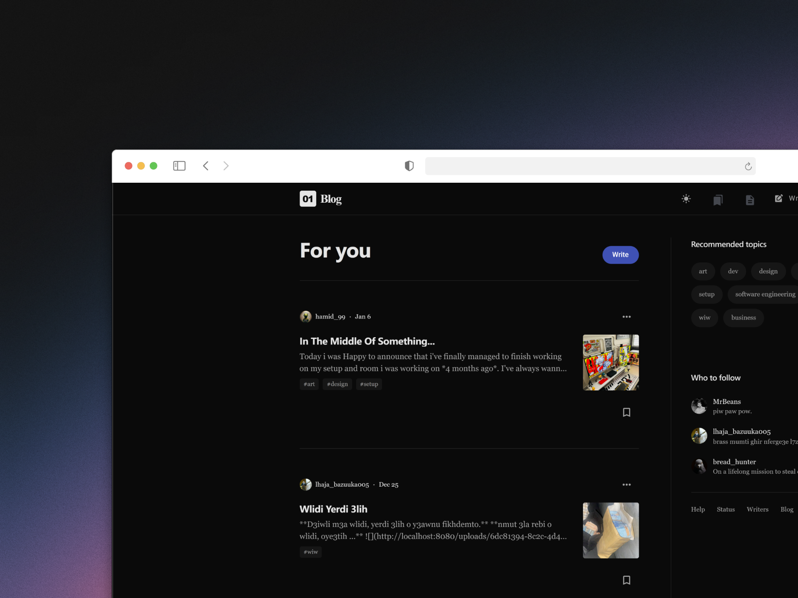
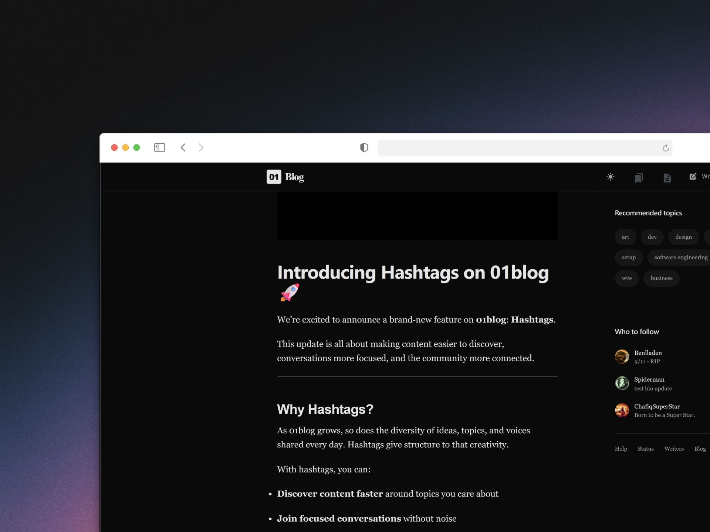
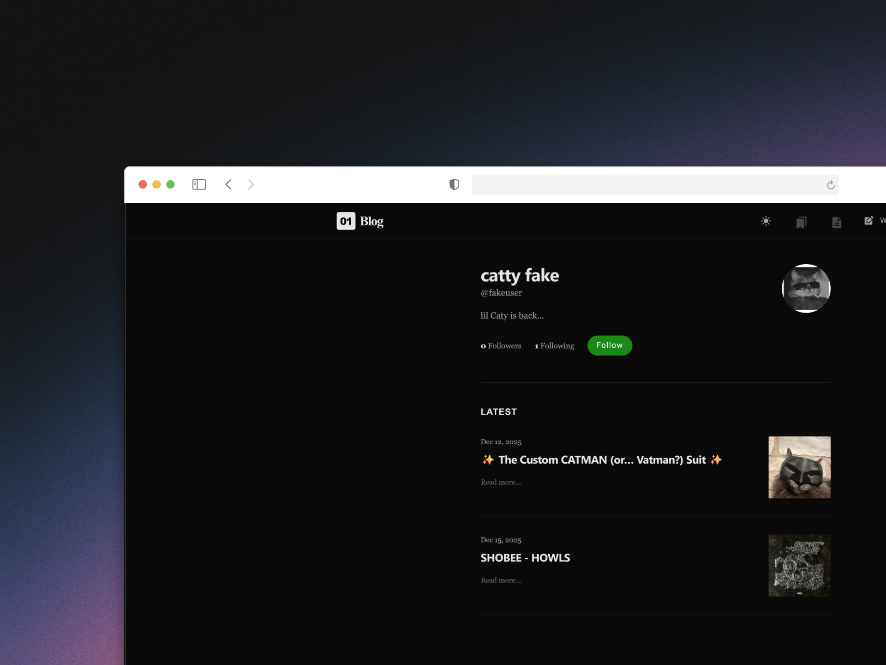
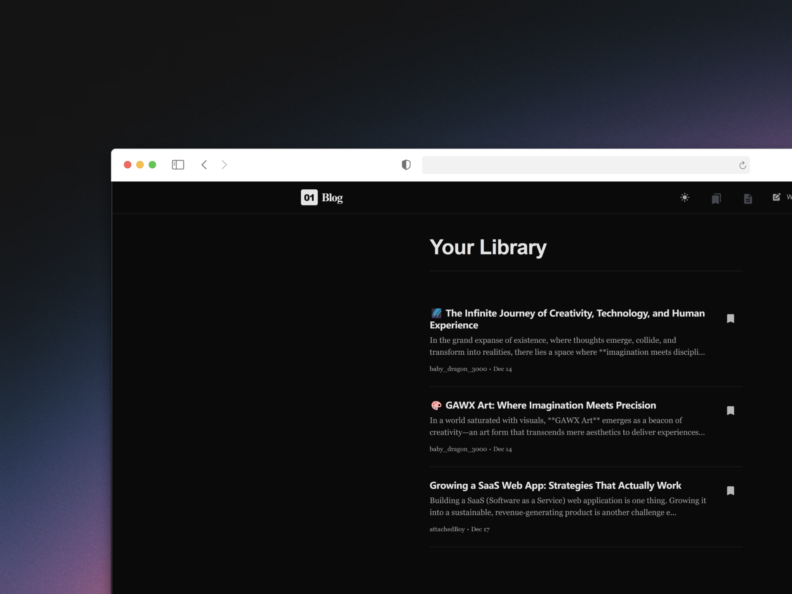
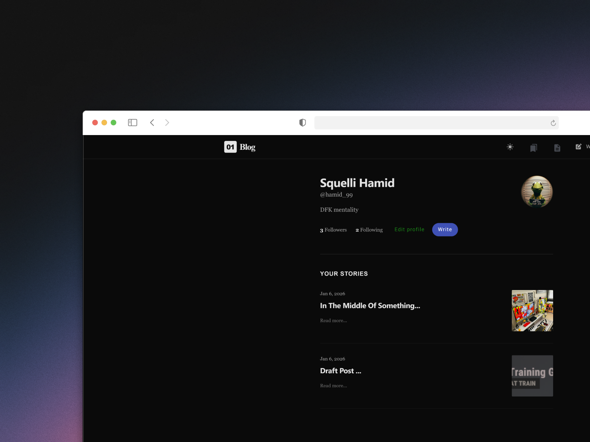
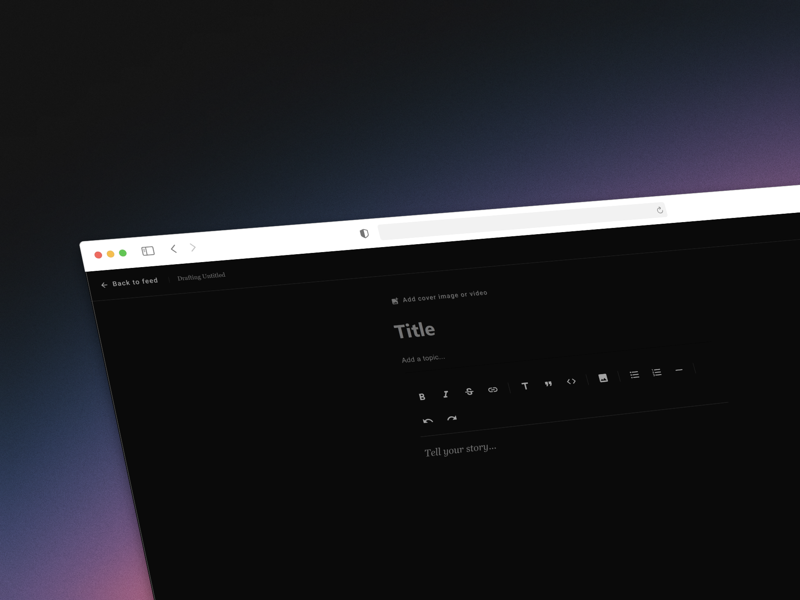
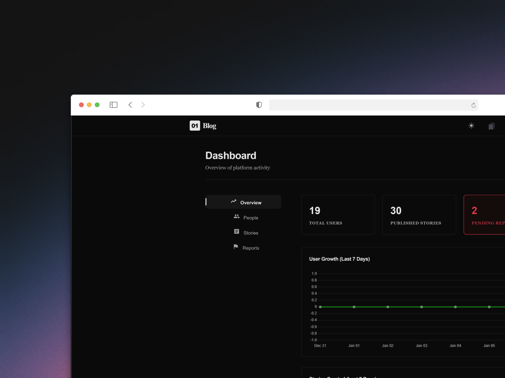
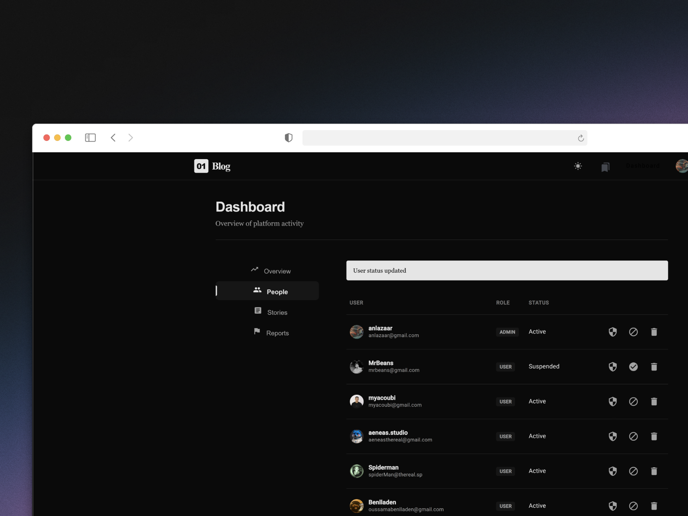
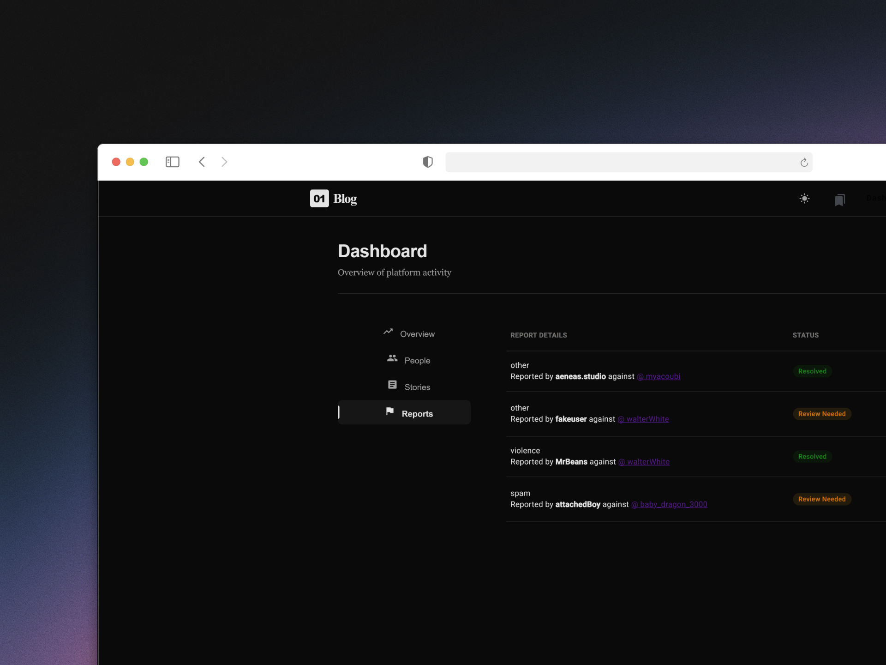

# 01Blog

## Overview

**01Blog** is a fullstack **social blogging platform** designed for students to document their learning journey. Users can create posts, follow other learners, and interact with content through likes, comments, and subscriptions. The platform also provides real-time notifications, draft management, and advanced authentication options to create a secure, engaging experience.

Built with **Java Spring Boot** for the backend and **Angular** for the frontend, 01Blog demonstrates modern fullstack development practices, including secure authentication, role-based access control, and responsive UI design.

---

## Features

### Core Features

- **User Authentication & Authorization**

  - Register and login with email/password, Google OAuth, or GitHub OAuth
  - Role-based access control: `user` and `admin`
  - Secure password storage with Spring Security & JWT

- **User Profiles ("Blocks")**

  - Public profile page for each user displaying all their posts
  - Subscribe/unsubscribe to users
  - View followers and subscriptions
  - Real-time notifications for new posts from followed users

- **Posts**

  - Create, edit, delete posts with media (images/videos) and text
  - Markdown support for rich text formatting
  - Draft posts and save posts for later reading
  - Hashtags support for better content discovery
  - Timestamps, likes, and comments on each post
  - Infinite scroll for content feeds

- **Post Interaction**

  - Like and comment on posts (real-time updates)
  - Media upload with previews
  - Notifications for likes, comments, and follows

- **Reports & Moderation**

  - Users can report inappropriate content with a reason
  - Reports are visible only to admins
  - Admin panel for user management, post moderation, and handling reports

- **Admin Dashboard**

  - View and manage all users and posts
  - Ban or delete users, remove inappropriate posts
  - Analytics: most active users, most reported users, post statistics
  - Clean UI designed for moderation efficiency

- **UI/UX**

  - Responsive design with Angular Material
  - Dark mode toggle (optional)
  - Clean, modern layout with intuitive navigation

---

## Bonus Features

- Real-time notifications using **SSE**
- Infinite scroll for feeds and posts
- Markdown editor with live preview
- Save posts to read later
- Hashtags support for content organization
- Multi-auth login (Google & GitHub OAuth)

---

## Tech Stack

| Layer           | Technology                                                    |
| --------------- | ------------------------------------------------------------- |
| Backend         | Java Spring Boot, Spring Security, JWT, JPA, PostgreSQL/MySQL |
| Frontend        | Angular, Angular Material                                     |
| Realtime        | SSE                                                           |
| Authentication  | Email/Password, Google OAuth, GitHub OAuth                    |
| Media Storage   | Local filesystem                                              |
| Version Control | Git & GitHub                                                  |

---

## Architecture

- **Backend**: RESTful API using Spring Boot

  - Authentication & authorization
  - User management
  - Posts CRUD with media
  - Notifications & reporting
  - Admin endpoints

- **Frontend**: Angular SPA

  - Components for feed, user block, post management, notifications
  - Routing and services for API integration
  - Responsive UI with Angular Material
  - Infinite scroll and markdown support

- **Database**: Relational SQL database (PostgreSQL or MySQL)

  - Tables: Users, Posts, Comments, Likes, Subscriptions, Reports, Notifications
  - Optimized for feed queries and real-time updates

---

## Installation

### Backend

1. Clone the repository:

```bash
git clone https://github.com/yourusername/01Blog.git
cd 01Blog/backend
```

2. Configure your database in `application.properties`:

```properties
spring.datasource.url=jdbc:postgresql://localhost:5432/01blog
spring.datasource.username=YOUR_DB_USERNAME
spring.datasource.password=YOUR_DB_PASSWORD
spring.jpa.hibernate.ddl-auto=update
```

3. Run the backend:

```bash
./mvnw spring-boot:run
```

---

### Frontend

1. Navigate to frontend directory:

```bash
cd ../frontend
```

2. Install dependencies:

```bash
npm install
```

3. Run the frontend:

```bash
ng serve
```

4. Open `http://localhost:4200` in your browser.

---

## Usage

- Register a new account or login with Google/GitHub
- Create, edit, or delete posts from your block
- Subscribe to other users to receive real-time notifications
- Like and comment on posts
- Report inappropriate content (for admins to moderate)
- Admins can access `/admin` dashboard to manage users and posts

---

## Screenshots

| Home Feed         | Post Page         |
| ----------------- | ----------------- |
|  |  |

| User Page         | Saved Posts       |
| ----------------- | ----------------- |
|  |  |

| Profile Page      | Create Post       |
| ----------------- | ----------------- |
|  |  |

| Admin Dashboard   | Users Dashboard   |
| ----------------- | ----------------- |
|  |  |

| Reports Dashboard |
| ----------------- |
|  |

---

## Contributing

1. Fork the repository
2. Create a feature branch (`git checkout -b feature/my-feature`)
3. Commit your changes (`git commit -m 'Add feature'`)
4. Push to the branch (`git push origin feature/my-feature`)
5. Open a Pull Request

---

## License

MIT License © 2026 Anass Lazaar

---

## Resources

- [Spring Boot Documentation](https://spring.io/projects/spring-boot)
- [Angular Documentation](https://angular.io/docs)
- [Angular Material](https://material.angular.io/)
- [Spring Boot File Upload](https://www.bezkoder.com/spring-boot-upload-file-database/)
- [JWT Introduction – Auth0](https://auth0.com/learn/json-web-tokens/)
- [Spring Security Basics – Java Guides](https://www.javaguides.net/2022/01/spring-security-tutorial.html)
- [PostgreSQL Basics](https://www.postgresqltutorial.com/)
- [JPA Guide – Baeldung](https://www.baeldung.com/the-persistence-layer-with-spring-data-jpa)
